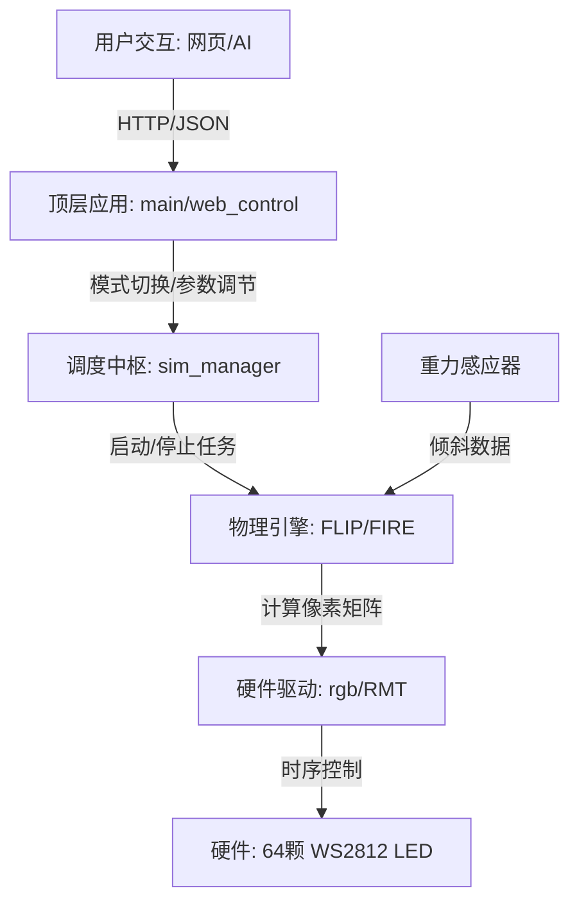

# esp32-led-matrix 项目架构与核心原理深度解析

该项目是一个集成了硬件驱动、物理引擎、实时操作系统 (RTOS) 与 AI 交互的典型嵌入式 AIoT 案例。本文将从架构设计、核心模块和控制链路三个维度为您深度解析。

---

## 一、 整体逻辑架构：分层与协同

项目采用了 **硬件抽象层 (BSP) -> 中间件层 (Middlewares) -> 应用层 (Main)** 的三层架构，这种设计实现了逻辑与硬件的解耦。

---

## 二、 核心模块详解

### 1. 硬件驱动层 (Muscle)
*   **模块路径**：`components/BSP/Display/rgb.c`
*   **核心技术**：**ESP32 RMT (Remote Control)** 配合 **DMA**。
*   **实现原理**：WS2812B 灯珠需要精确到纳秒级的单线通信协议。驱动程序将 8x8 的像素数组（RGB 24bit 数据）转换为 RMT 硬件能识别的波形序列。
*   **关键点**：由于采用了 DMA 传输，像素刷新过程几乎 **零 CPU 占用**，保证了物理计算的平滑。

### 2. 算法与中间件层 (Brain)
这是系统的“数学中心”，负责将物理规律映射到像素点。

*   **物理模拟 (`flip.c`)**：
    *   **原理**：简化版的 **PBF (Position-Based Fluids)**。
    *   **处理流**：获取陀螺仪重力向量 -> 计算粒子加速度 -> 解算碰撞约束 -> 渲染到显存。
*   **火焰效果 (`fire_sim.c`)**：
    *   **原理**：**细胞自动机 (Cellular Automata)**。
    *   **逻辑**：根据随机热源产生底层亮度，利用邻域平滑算法向上叠加，模拟热力上升的视觉效果。
*   **调度管理器 (`sim_manager.c`)**：
    *   **职责**：负责 FreeRTOS 任务的生命周期管理。
    *   **亮点**：动态创建和销毁任务（`vTaskDelete`），确保同一时刻只有一个模拟模式在运行，极大节省了 SRAM（内存）。

### 3. 网络与交互层 (Soul)
*   **模块路径**：`main/web_control.c`
*   **嵌入式 Web 服务**：
    *   将 HTML/CSS/JS 静态资产作为长字符串直接存储在 Flash 环境中。
    *   实现了单片机端的 **API 控制中心**。
*   **AI 代理模式**：
    *   **HTTPS 反向代理**：ESP32 充当转发器，将客户端请求加上 `Bearer` 令牌转发给云端 AI。
    *   **流式响应**：采用 Chunked 传输机制，在 RAM 低至几十 KB 的情况下也能处理上万字节的 AI 回复。

---

## 三、 核心控制链路：从 AI 意图到 LED 亮起

让我们追踪一条自然语言指令的生命周期：

1.  **输入**：用户点击网页 Chat 框发送：“给我一点水”。
2.  **JS 打包**：前端 JavaScript 将消息通过 POST 发送至 ESP32 的 `/api/chat`。
3.  **C 语言透传**：`web_control.c` 收到请求，调用本地 `esp_http_client` 发起 HTTPS 请求到云端 API。
4.  **语义决策**：由于我们注入了 System Prompt，云端 AI 会返回特定格式：`{"control": {"mode": "water"}}`。
5.  **逻辑转换**：单片机将收到的 JSON 转发回手机前端，前端 JS 执行路由跳转，请求 `/api/mode?value=water`。
6.  **RTOS 切换**：`sim_manager` 收到指令，停止当前的火焰模拟任务，重新分配内存，启动流体模拟任务。
7.  **显示更新**：LED 屏幕瞬间从热烈的橙红色转变为受重力感应控制的蓝色水流。

---

## 四、 架构优势总结

*   **高实时性**：计算（核1）与通信（核0）并行，互不干扰。
*   **高健壮性**：即使网络断开，物理按键依然可以通过 NVS 存储的状态安全地进行本地控制。
*   **极易扩展**：通过 BSP 层的隔离，更换 LED 屏幕尺寸或传感器型号时，上层逻辑几乎无需改动。

---
*本文旨在提供对此项目的全局俯瞰，更多详细实现细节请参考各模块对应的源代码注释。*