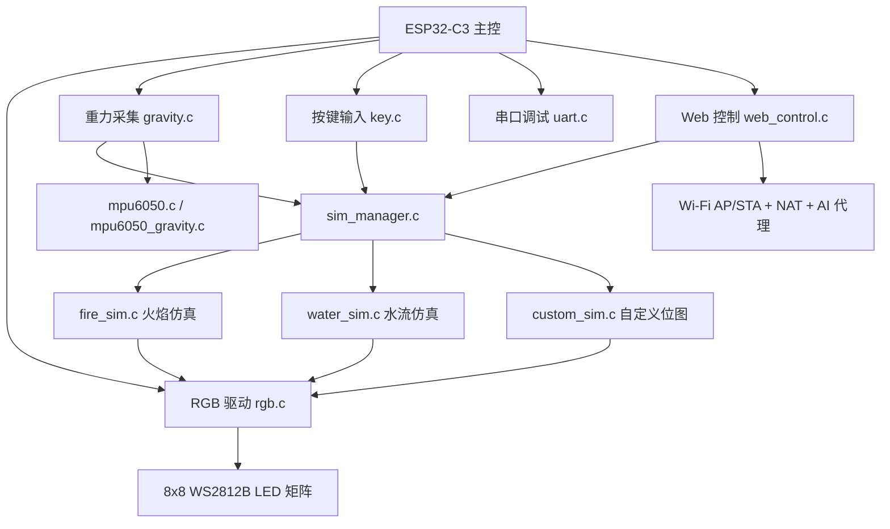
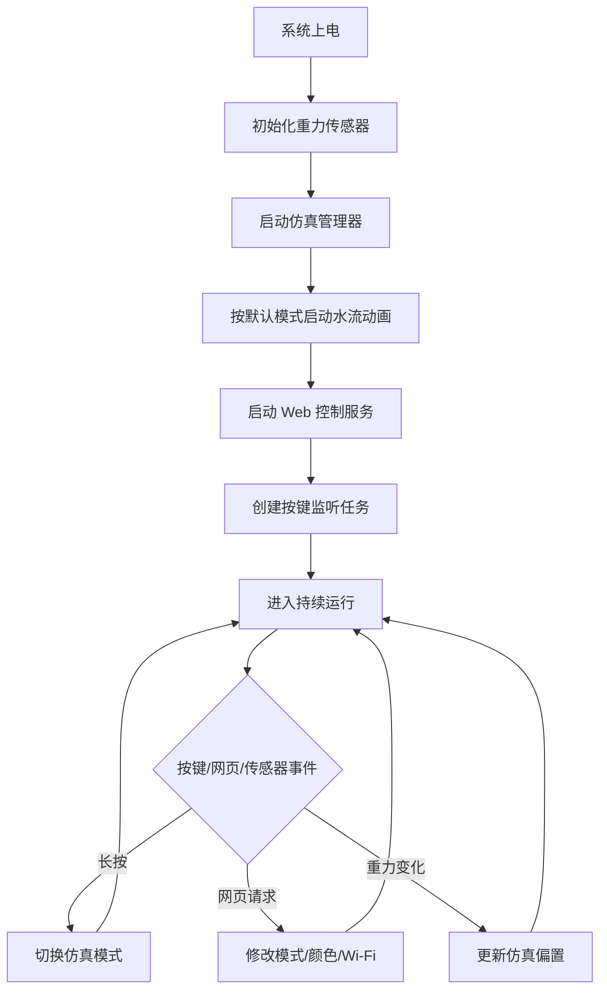
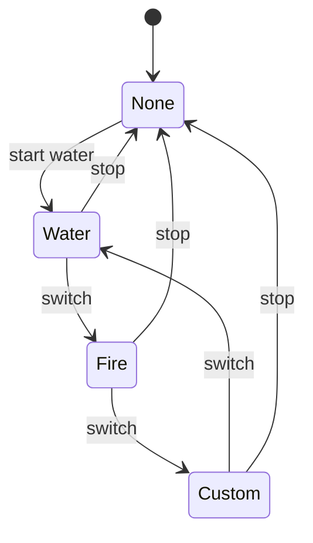

<div align="center">

### 湖南大学电气与信息工程学院

## 本科生课程设计

<br>


<br><br>

<div align="left">

**题目：** 基于 ESP32-C3 的动态交互 LED 矩阵系统  
**课程：** 课程设计  
**专业：** 自动化  
**班级：** 自动化2304班  
**学号：** 202307030405  
**姓名：** 林烽  
**同组人姓名：** 谢骐聪  
**指导老师：** 梁桥康  
**设计时间：** 2026年5月8日

</div>

</div>

<div style="page-break-after: always;"></div>

# 摘要

本课程设计实现了一套基于 ESP32-C3 的动态交互 LED 矩阵显示系统。系统以 8x8 WS2812B 点阵为显示载体，结合 MPU6050 姿态传感器、物理按键、Wi-Fi Web 控制界面、NAT 网络转发以及云端 AI 聊天代理，构成了一个集物理仿真、网络交互与视觉艺术于一体的嵌入式应用。软件部分采用 ESP-IDF 与 FreeRTOS 进行任务划分与调度，主要包含仿真管理器、火焰模拟、水流模拟、自定义位图显示、重力采集、RGB 驱动和 Web 控制等模块。系统能够在火焰、水流和自定义位图三种模式之间切换，并支持通过网页修改显示模式、颜色和 Wi-Fi 连接状态。整个设计突出“资源受限条件下的算法移植、实时渲染与多模块协同”这一课程设计主题。

**关键词：** ESP32-C3；LED 矩阵；FLIP；Doom Fire；MPU6050；FreeRTOS；Web 控制；NAT；AI 代理

---

# 目录

1. [第一章 绪论](#第一章-绪论)
   1.1 [课题背景与任务要求](#11-课题背景与任务要求)
   1.2 [设计方法与开发过程](#12-设计方法与开发过程)
   1.3 [系统实现功能](#13-系统实现功能)
   1.4 [设计思路与技术路径](#14-设计思路与技术路径)
2. [第二章 总体方案与详细设计](#第二章-总体方案与详细设计)
   2.1 [系统总体架构](#21-系统总体架构)
   2.2 [硬件设计](#22-硬件设计)
   2.3 [软件设计](#23-软件设计)
   2.4 [核心模块说明](#24-核心模块说明)
   2.5 [程序流程图](#25-程序流程图)
   2.6 [仿真设计过程与结果](#26-仿真设计过程与结果)
   2.7 [元器件清单](#27-元器件清单)
   2.8 [系统操作说明](#28-系统操作说明)
3. [第三章 心得体会](#第三章-心得体会)
4. [第四章 结论与致谢](#第四章-结论与致谢)
   4.1 [结论](#41-结论)
   4.2 [致谢](#42-致谢)
5. [参考文献](#参考文献)
6. [附录](#附录)
7. [附件](#附件)

---

# 第一章 绪论

## 1.1 课题背景与任务要求

随着嵌入式系统、物联网与数字艺术的快速发展，传统“静态点亮”的 LED 显示方式已经难以满足课程设计对综合能力的要求。课程设计不再只是验证某一个外设是否可用，而是要求学生围绕一个真实问题完成系统级方案设计：既要考虑主控芯片的算力和内存限制，又要兼顾显示效果、交互方式、网络通信、稳定性与可扩展性。本课题以 ESP32-C3 为核心，围绕 LED 矩阵动态显示展开，目标是在资源有限的微控制器上实现具备一定物理感知能力和远程控制能力的交互式显示系统。

本设计的任务要求可以概括为四个层次。第一层是显示层，要求系统能够驱动 LED 矩阵稳定刷新，并输出火焰、水流和自定义图案等动态画面。第二层是交互层，要求系统支持物理按键和姿态传感输入，能够根据设备倾斜方向改变动画效果，同时允许用户在不同仿真模式之间切换。第三层是网络层，要求系统能够通过 Wi-Fi 提供网页控制界面，支持连接外部路由器、保存网络信息、开启 AP 热点，并实现 NAT 转发，使连入热点的设备也可以访问外网。第四层是扩展层，要求系统能够把云端 AI 能力接入本地硬件控制链路，使网页端的自然语言输入可以转化为具体的灯效控制动作。与普通“点亮灯珠”的课程作业相比，该课题更强调系统设计能力、模块协作能力和工程实现能力。

此外，课程设计还强调真实硬件环境下的稳定运行。ESP32-C3 的内存、算力和外设资源都不充裕，若直接将复杂算法照搬到 MCU 上，往往会遇到帧率不足、任务阻塞、内存碎片、显示撕裂或传感器抖动等问题。因此，本设计必须围绕“可运行、能交互、可维护、易扩展”四个原则展开，而不是仅追求某一个局部效果。

## 1.2 设计方法与开发过程

本项目采用“先硬件驱动、后算法移植、再系统集成、最后交互扩展”的迭代式开发流程。首先完成 RGB 驱动与 LED 面板基础显示，验证 WS2812B 的数据链路、面板映射和亮度限制是否正确；随后接入 MPU6050，完成 I2C 初始化、重力向量采集以及滤波处理，为后续物理仿真提供输入；接着实现仿真管理器，对火焰、水流和自定义位图三种模式统一调度，保证任务切换时旧任务能够安全退出，新任务能够平稳启动；最后在 Web 层加入 Wi-Fi 配置、模式切换、颜色设置、NAT 与 AI 代理接口，形成完整的人机交互系统。

在实现方法上，设计遵循了“算法适配硬件”的原则。火焰和流体仿真并不是直接搬用 PC 端版本，而是根据 LED 矩阵分辨率和 MCU 性能重新组织数据结构。例如，火焰仿真通过热量查找表降低渲染成本，水流仿真通过 LUT 预计算将密度映射为颜色，自定义模式则通过位图与物理索引映射简化显示路径。RGB 驱动模块对全局颜色和面板最大值做双重限制，避免灯珠电流过大。重力模块在采样后进行归一化、限幅和低通滤波，减少抖动对动画稳定性的影响。这样的处理方式体现了嵌入式开发中常见的“以工程可实现性为中心”的设计思路。

## 1.3 系统实现功能

从实际代码实现看，本系统已经完成以下主要功能：

1. 支持三种显示模式：火焰模拟、水流模拟和自定义位图显示。
2. 支持板载按键长按切换模式，默认按键接在 GPIO0。
3. 支持 MPU6050 姿态传感器采集重力向量，并用于火焰与水流方向调整。
4. 支持 Web 页面控制模式、颜色、Wi-Fi 连接和“Wi-Fi only”运行状态。
5. 支持 AP+STA 双模式运行，并可开启 NAT 转发，使热点终端可以共享外网连接。
6. 支持云端 AI 聊天代理，通过 HTTP 接口转发请求到大模型服务。
7. 支持自定义位图和全局颜色设置，便于展示简单图形或徽标。

系统默认开机模式为水流模式，启动后会先初始化重力传感器，再启动仿真管理器，最后打开 Web 控制服务与按键监控任务。这样安排的好处是系统进入主界面时就能够立即输出动画，同时保留网络控制和物理交互入口。

## 1.4 设计思路与技术路径

本课题的技术路径可以概括为“显示驱动打底、传感输入赋能、物理算法增色、网络控制扩展、AI 代理提升交互层次”。显示驱动是最基础的一层，若 LED 输出不稳定，则上层所有逻辑都缺乏意义；传感输入让系统从“被动播放”变成“随手势响应”；物理算法决定了动画是否具有观感和连续性；网络控制则让系统脱离物理按键限制；AI 代理使系统从“功能型设备”进一步转向“自然语言交互型设备”。

从显示技术的发展角度看，LED 点阵并不是新技术，但其真正的价值在于可以被算法重新定义。传统屏幕显示的是预先生成的图像，而本设计显示的是实时生成的物理过程：火焰不是静态像素，而是热量传播的离散化结果；水流不是简单动画，而是受重力向量影响的密度场；自定义位图不是固定图标，而是可以通过网页随时改写的用户输入。也就是说，系统将“像素”从单纯的显示单元，提升为物理系统的可视化终点。

从嵌入式计算的角度看，ESP32-C3 的资源远小于 PC 或手机，因此不能依赖复杂的实时求解器，也不能依赖大规模缓存。代码中采用了任务分离、查找表、限幅、预计算映射和低通滤波等常见优化手段，把“高复杂度物理过程”压缩到“可在 MCU 上稳定运行”的程度。这个过程本身就是课程设计中最重要的技术训练：不是把功能做出来就结束，而是要思考如何让功能在有限硬件上长期、稳定、可维护地运行。

---

# 第二章 总体方案与详细设计

## 2.1 系统总体架构

系统采用分层式结构，底层是硬件驱动层，中间是传感与仿真层，顶层是用户交互层。硬件驱动层负责 LED 输出、I2C 采样和基础外设管理；传感与仿真层负责重力数据处理、流体/火焰算法和模式管理；用户交互层负责 Web 控制、Wi-Fi 配置、NAT 转发以及 AI 代理。



上图对应了本设计的实际软件结构：`main.c` 作为系统入口，负责启动重力模块、仿真管理器、Web 服务和按键监听任务；`sim_manager.c` 负责不同仿真模式的切换；`fire_sim.c`、`water_sim.c`、`custom_sim.c` 负责生成不同显示内容；`gravity.c` 负责从 MPU6050 获取重力向量并作为仿真输入；`rgb.c` 负责把最终像素数据推送到 LED 矩阵；`key.c` 负责物理按键中断与消抖；`uart.c` 提供调试输出；`web_control.c` 负责网页控制、Wi-Fi 配置、NAT 和 AI 代理。

系统中的关键数据流为：传感器采样得到重力向量，传给仿真模块作为偏置输入；仿真模块生成热量场、密度场或位图数据，再通过 RGB 驱动写入 LED 缓冲区；Web 控制模块则负责更改仿真模式、调色板、Wi-Fi 状态以及自定义显示内容。

## 2.2 硬件设计

### 2.2.1 主控与显示器件

本系统实际采用 ESP32-C3 作为主控芯片。选择该芯片的主要原因是其兼具 Wi-Fi 能力、FreeRTOS 运行环境和足够的外设资源，能够在较低成本下完成网络控制与实时显示。显示部分采用 8x8 WS2812B LED 矩阵，共 64 个像素点。代码中通过 `panel_config.h` 将面板尺寸固定为 8x8，并将单通道最大值限制为 20，这说明整个系统并非追求高亮度，而是更强调视觉效果与供电安全之间的平衡。

LED 输出由 `rgb.c` 统一封装，底层使用 `led_strip` 组件并通过 SPI2 + DMA 方式刷新。这样做的优点是 CPU 不必持续参与波形时序生成，显示任务可以把更多时间留给算法计算。

### 2.2.2 传感器与输入模块

系统使用 MPU6050 作为姿态传感器，通过 I2C 总线连接到 ESP32-C3。代码中 I2C 的 SDA 为 GPIO3，SCL 为 GPIO4，频率为 400kHz。传感器采样任务以 50Hz 运行，对采集到的加速度进行归一化、限幅和低通滤波，再输出稳定的二维重力向量。该向量被火焰和水流仿真共同使用，用于模拟设备倾斜带来的方向偏移。

物理按键连接在 GPIO0，程序中采用轮询方式完成长按识别。长按超过 1000ms 后触发模式切换，按键逻辑经过消抖处理，能够避免因机械抖动而造成误触发。

### 2.2.3 供电与连接说明

由于 WS2812B 矩阵需要独立供电，系统采用 5V 电源为 LED 与主控提供稳定电压。面板亮度并没有设置为满值，而是通过全局颜色系数和单灯珠最大值控制输出强度，从而降低瞬时电流和发热风险。硬件连接上，显示、传感与按键三部分相对独立，便于调试与后续扩展。

## 2.3 软件设计

### 2.3.1 任务划分与调度

软件采用 ESP-IDF + FreeRTOS 结构，核心任务包括：

1. `gravity_sensor_task`：负责 MPU6050 数据采集与滤波，运行频率为 50Hz。
2. `sim_task`：分别由 fire_sim、water_sim、custom_sim 三类仿真任务实现，负责显示内容生成与渲染。
3. `mode_switch_task`：由 `main.c` 创建，负责监听物理按键并请求模式切换。
4. HTTP 服务任务：由 `web_control.c` 创建，负责网页请求、NAT 配置、Wi-Fi 连接和 AI 代理。

主程序会先启动重力模块，再初始化仿真管理器，并在默认模式下启动仿真任务。若设备为双核平台，仿真任务会尽量固定到指定核心，减少任务迁移带来的抖动。这样的调度方式体现了对实时显示和网络通信并行执行的考虑。

### 2.3.2 数据流与状态机

系统状态可抽象为“初始化状态、运行状态、切换状态、停止状态”四类。`sim_manager` 作为状态机中枢，统一控制当前模式、目标模式和停止过程。切换模式时先调用 `stop_mode()` 停止旧任务，再调用 `start_mode()` 启动新任务，避免多个仿真同时占用 RGB 缓冲区。对于“Wi-Fi only”场景，Web 控制层还会主动暂停仿真并清空屏幕，把算力优先让给网络转发。

## 2.4 核心模块说明

### 2.4.1 RGB 驱动模块

RGB 模块是整个系统输出端的基础。它负责完成像素索引、全局颜色缩放、面板亮度限制和最终刷新。代码中使用 `panel_led_index()` 将逻辑坐标映射到物理灯珠索引，适配 8x8 面板的列优先连接方式。全局颜色接口允许网页或自定义模式统一改变画面色调，而面板最大值限制则用于保证供电安全。

### 2.4.2 重力采集模块

重力模块从 MPU6050 读取加速度值，进行归一化后转换成二维向量 `(gx, gy)`。其核心作用不是精确测量姿态角，而是为视觉仿真提供稳定、连续的方向偏置。代码中引入了低通滤波，说明系统更重视视觉平滑性而非瞬时响应。

### 2.4.3 仿真管理器模块

`sim_manager` 是系统模式调度的核心。它将火焰、水流和自定义位图三种模式统一抽象为 `sim_mode_t`，并提供 `init`、`start`、`switch`、`stop` 和 `current` 等接口。这样设计的好处是上层无需关心各个仿真模块内部如何创建任务、如何退出，只需要发出目标模式即可。

### 2.4.4 火焰模拟模块

火焰模块基于 Doom Fire 思路实现。代码中使用 37 级调色板和颜色查找表，把热量值快速映射为 RGB 值。仿真以 30 FPS 运行，重力传感器的横向分量会影响火焰倾斜方向，按键则用于切换经典、蓝火和紫火三套配色。该模块的重点不在复杂物理，而在于用较低计算开销表现出足够好的视觉连续性。

### 2.4.5 水流模拟模块

水流模块基于 FLIP 思路进行简化实现，渲染帧率同样为 30 FPS。代码先构建三套调色板 LUT，再把流体网格密度映射到 LED 颜色。重力向量同时作用于 x、y 两个方向，使水流能随设备倾斜而自然偏转。该模块体现了“复杂算法嵌入式化”的过程：通过预计算、查表和固定分辨率网格，把原本较重的流体仿真压缩到 MCU 可承受的范围内。

### 2.4.6 自定义位图模块

自定义模块以 0/1 位图为输入，将每个点映射为亮或灭。它的作用非常直接：既可以显示简单图标，也可以作为网页端自定义绘制的结果输出。该模块帧率为 20 FPS，逻辑上更简单，因此适合承载用户定义图案、状态图标或占位画面。

### 2.4.7 Web 控制、NAT 与 AI 代理模块

Web 控制模块是系统的人机交互入口。它提供根页面、状态查询、模式切换、自定义位图上传、颜色设置、Wi-Fi 连接、Wi-Fi only 开关以及聊天代理等 HTTP 接口。AP 默认名称为 `LED-Matrix`，密码为 `12345678`。当设备作为热点运行并成功接入外部路由器后，系统会尝试开启 NAT 转发，并将 STA 侧 DNS 同步给 AP，保证连入热点的终端能够正常访问互联网。

AI 代理部分使用 HTTPS 客户端把网页请求转发到云端聊天接口，并通过自定义 Header 传递 API Key。这样做的意义在于：前端不直接暴露密钥，浏览器也不必处理跨域与认证细节，单片机只需要完成安全转发和状态控制即可。对于课程设计而言，这一部分很好地展示了“嵌入式设备并不只是显示终端，也可以作为轻量级网关和业务代理”的思路。

## 2.5 程序流程图

### 2.5.1 主程序流程



### 2.5.2 模式切换流程



## 2.6 仿真设计过程与结果

系统在实际运行中表现出较好的稳定性和连续性。火焰模式与水流模式均按照 30 FPS 刷新，自定义位图模式按照 20 FPS 刷新。火焰模式的颜色过渡平滑，三套调色板切换时没有出现明显卡顿；水流模式能够根据设备倾斜方向改变整体流向，具有较强的交互感；自定义模式则适合显示简单图案和状态信息。

从实现过程来看，最重要的优化点有三项。第一，使用 LUT 代替每帧复杂颜色计算；第二，使用 `panel_led_index()` 统一管理物理坐标映射，避免在渲染循环中反复判断布线方式；第三，通过任务分离将传感、显示和网络工作拆开，降低单一任务对系统的阻塞影响。若后续需要继续完善，可以补充运行截图，将火焰、水流、自定义位图和网页控制界面分别整理为实验结果图。

## 2.7 元器件清单

| 序号 | 元器件 | 规格/型号 | 数量 | 作用 |
|---|---|---|---|---|
| 1 | 主控板 | ESP32-C3 开发板 | 1 | 系统控制、Wi-Fi 通信、任务调度 |
| 2 | LED 矩阵 | 8x8 WS2812B 点阵 | 1 | 图像与动画显示 |
| 3 | 姿态传感器 | MPU6050 模块 | 1 | 采集重力向量 |
| 4 | 连接材料 | 杜邦线/排针/焊线 | 若干 | 硬件连接 |

## 2.8 系统操作说明

1. 上电后，系统默认进入水流模式，并开始刷新 LED 点阵。
2. 连接 `LED-Matrix` 热点，密码为 `12345678`，在浏览器打开控制页面。
3. 在网页中可以切换火焰、水流、自定义图案模式，也可以修改颜色和上传位图数据。
4. 若设备已连接外部路由器，可开启 NAT 转发，让热点终端共享外网连接。
5. 长按 GPIO0 对应按键可以在水流、火焰、自定义三种模式之间循环切换。
6. 倾斜设备时，火焰和水流的方向会随重力向量变化，形成交互效果。
---

# 第三章 心得体会

本次课程设计让我最直接的体会是：嵌入式开发并不只是把外设点亮，更重要的是把多个看似独立的功能组织成一个有层次、有边界、可持续运行的系统。起初我容易把注意力放在单个模块的“效果”上，例如火焰好不好看、网页能不能打开、传感器有没有数值；但随着项目推进，我逐渐意识到真正的难点在于模块之间的协作关系：传感器采样是否会影响显示刷新，Web 请求是否会阻塞仿真任务，任务切换时是否会留下资源泄漏，颜色映射是否会导致亮度过高。这些问题看起来不显眼，却决定了系统最终能否稳定工作。

通过实现火焰、水流和自定义位图三种模式，我对查找表、任务调度、状态机设计和硬件抽象有了更深的理解。特别是重力模块与仿真模块的联动，让我体会到“输入数据不一定要特别复杂，但必须足够稳定”，因为动画系统最怕的不是慢，而是抖。Web 控制和 NAT 转发部分则让我认识到，现代嵌入式系统已经不再是孤立设备，而是可以接入网络、接入云端、甚至接入 AI 服务的边缘终端。把 AI 代理嵌入到一个小型 LED 矩阵项目中，不仅提升了交互层次，也让我对物联网系统的架构有了更完整的认识。

总体而言，这次设计训练了我从“写功能”到“搭系统”的思维方式。后续如果继续完善，我希望能进一步优化网页界面、补充更多截图、增加更多自定义图案，并尝试把更多模块的状态显示在网页上，形成更完整的可视化管理界面。

---

# 第四章 结论与致谢

## 4.1 结论

本课程设计围绕 ESP32-C3 动态交互 LED 矩阵系统完成了从硬件驱动、传感采集、物理仿真到网络交互的完整实现。系统能够在 8x8 WS2812B 面板上稳定呈现火焰、水流和自定义位图三种显示效果，并支持按键、重力和网页三种交互方式。代码结构采用模块化设计，便于后续维护和二次开发。整体来看，该项目较好地达到了课程设计对“系统性、完整性和可扩展性”的要求。

## 4.2 致谢

感谢课程设计指导教师在需求梳理、结构设计和调试思路方面给予的帮助。感谢 ESP-IDF、FreeRTOS 以及各开源组件提供的基础支持，使本项目能够在较短时间内完成集成。也感谢在调试过程中提供建议的同学和朋友，帮助我不断修正系统设计中的问题。

---

# 参考文献

[1] 乐鑫科技. ESP-IDF Programming Guide.  
[2] Robert Bridson. Fluid Simulation for Computer Graphics.  
[3] Fabien Sanglard. Game Engine Black Book: Doom.  
[4] Amazon Web Services. FreeRTOS Kernel Reference Manual.  
[5] MPU6050 数据手册及相关驱动文档。

---

# 附录

## 附录A：核心源码文件说明

以下文件是本设计的主要实现文件：

- [main/main.c](../main/main.c)：系统入口、默认模式启动、按键长按切换。
- [main/web_control.c](../main/web_control.c)：Web 服务器、Wi-Fi 连接、NAT、AI 代理与网页控制接口。
- [components/Middlewares/SIM/sim_manager.c](../components/Middlewares/SIM/sim_manager.c)：仿真模式管理与切换。
- [components/Middlewares/SIM/fire_sim.c](../components/Middlewares/SIM/fire_sim.c)：火焰仿真与调色板渲染。
- [components/Middlewares/SIM/water_sim.c](../components/Middlewares/SIM/water_sim.c)：流体仿真与颜色 LUT 映射。
- [components/Middlewares/SIM/custom_sim.c](../components/Middlewares/SIM/custom_sim.c)：自定义位图显示与颜色控制。
- [components/Middlewares/GRAVITY/gravity.c](../components/Middlewares/GRAVITY/gravity.c)：MPU6050 重力采集与滤波。
- [components/BSP/RGB/rgb.c](../components/BSP/RGB/rgb.c)：WS2812B 驱动、全局颜色与亮度限制。

## 附录B：程序流程伪代码

```c
初始化重力传感器;
启动仿真管理器;
以默认模式启动动画;
启动 Web 控制服务;
创建按键监听任务;

while (系统运行) {
    读取重力向量;
    更新当前仿真状态;
    如果按键长按，则切换模式;
    如果网页请求到达，则更新模式、颜色或 Wi-Fi 状态;
    将渲染结果刷新到 LED 矩阵;
}
```

---

# 附件

## 附件A：系统截图

建议在最终提交版本中补充以下截图：

- 图A-1 Web 控制主页截图
- 图A-2 火焰模式运行截图
- 图A-3 水流模式运行截图
- 图A-4 自定义位图运行截图
- 图A-5 Wi-Fi 配置与 NAT 状态截图

## 附件B：说明文件

- 项目源码压缩包
- 串口日志文件
- 实物照片或调试照片

*** End Patch